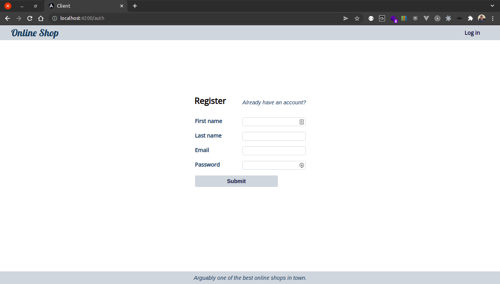
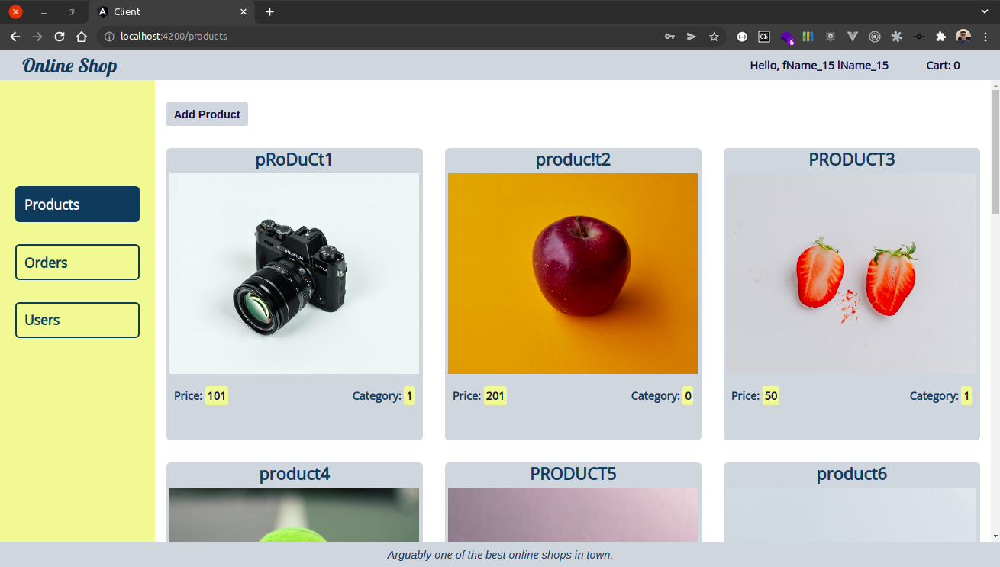
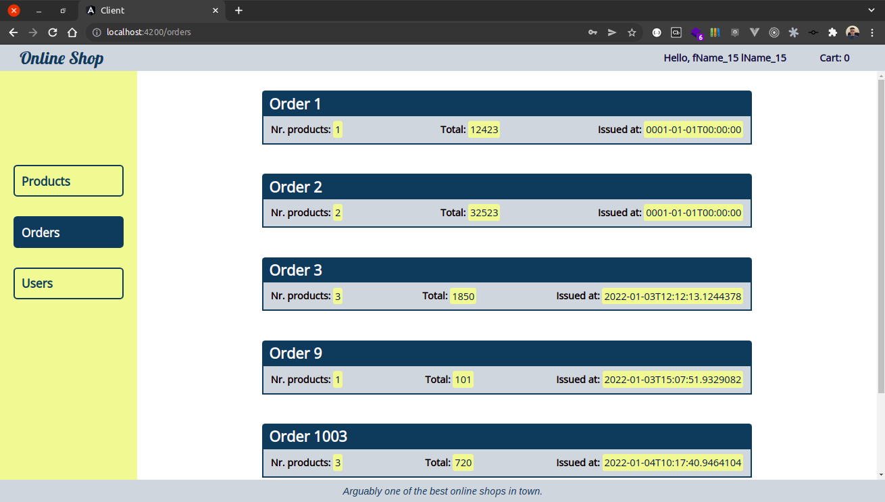
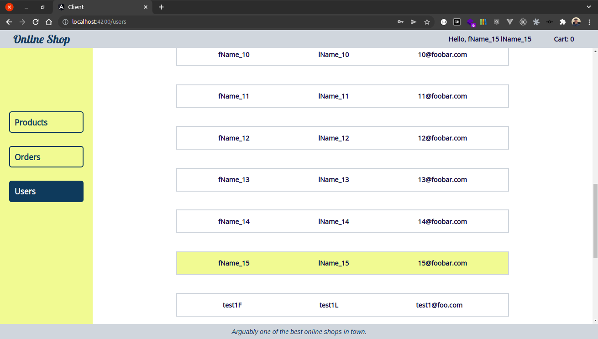
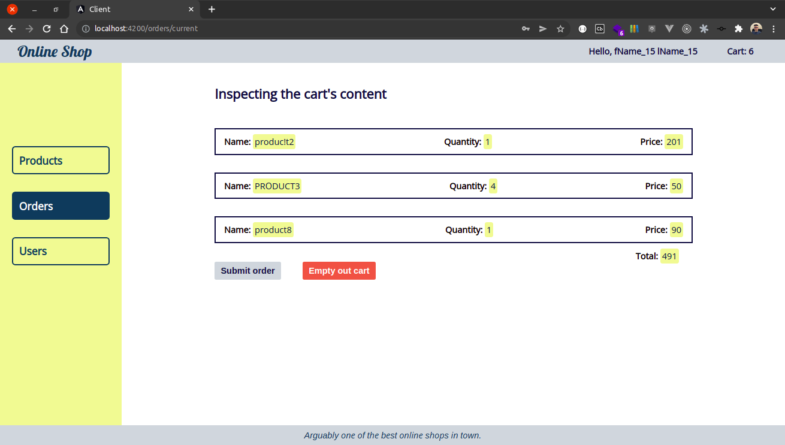

# Online Shop

## Setting up

### SQL Server

If this is the first time, run this command in order to fetch the `mssql` image and to start a container based on it.

```bash
docker run -e "ACCEPT_EULA=Y" -e "SA_PASSWORD=<PASSWORD>" --name daw_sqlserver -p 1433:1433 -d mcr.microsoft.com/mssql/server:2019-CU13-ubuntu-20.04
```

On subsequent times, you can simply run this command:

```bash
docker container start daw_sqlserver
```

You might need to create the database manually, so these commands could be of help:

```sql
-- Make sure to run these from the mssql CLI.

create database online_shop;
go

use online_shop;
go
```

Then, you can run the seed the database by following these steps:

* run the migrations, this is where the `product` table is populated
* start the *dotnet* server, this is where the `user` table is populated

### Client

Install the dependencies:

```bash
npm i
```

Start the DEV server:

```bash
# Use `npm run start -- -o` to automatically open a new browser tab once the server is ready.
npm run start
```

### Server

```bash
dotnet watch run
```

---

## Useful links

* https://docs.microsoft.com/en-us/aspnet/mvc/overview/older-versions/getting-started-with-ef-5-using-mvc-4/implementing-the-repository-and-unit-of-work-patterns-in-an-asp-net-mvc-application
* https://www.c-sharpcorner.com/article/implementing-unit-of-work-and-repository-pattern-with-dependency-injection-in-n/
* https://docs.microsoft.com/en-us/aspnet/core/data/ef-mvc/intro?view=aspnetcore-6.0
* https://docs.microsoft.com/en-us/aspnet/core/security/authentication/customize-identity-model?view=aspnetcore-6.0

---

## Learnings

* **service**(in the *.NET* context): an object that provides a service to other objects 

* **unit of work**: when using multiple repositories, they all share the same database context

* **repository**: mediates between the DAL and the business logic layer; a repository queries the data source for the data and then it maps the fetched data to the business entity;  
  it encapsulates the logic required to access data sources;  
  each repository only works against a single model class;  
  the repository layer - only to retrieve and set items in the data store 

## Screenshots

<div style="text-align: center;">
  
</div>

<div style="text-align: center;">
  
</div>

<div style="text-align: center;">
  
</div>

<div style="text-align: center;">
  
</div>

<div style="text-align: center;">
  
</div>